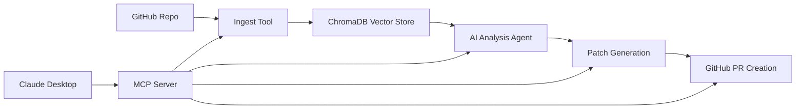

# GitHub Issue Resolution MCP Server

[](https://www.python.org/downloads/)
[](https://modelcontextprotocol.io/)
[](https://opensource.org/licenses/MIT)

A comprehensive **Model Context Protocol (MCP) server** that enables AI agents to analyze GitHub repositories, understand issues, generate solutions, and create pull requests automatically using advanced RAG (Retrieval Augmented Generation) techniques.

## 📝 Changelog

- [x] Added JSON extraction helper `_extract_json_from_response()` in `issue_solver/patch.py`
- [x] Enhanced `generate_patch_for_issue()` to clean LLM output and validate JSON structure
- [x] Added strict JSON validation in `create_github_pr_tool()` to prevent empty PRs
- [x] Improved error messages and troubleshooting guidance for patch generation and PR creation
- [x] Updated README and API reference documentation with changelog section

## 🌟 Features

### 🔍 **Intelligent Repository Analysis**
- **Repository-Specific RAG**: Each repository gets its own isolated knowledge base
- **Comprehensive Ingestion**: Processes documentation, code, issues, and PR history
- **Smart Chunking**: Optimized text processing for better AI comprehension
- **Real-time Progress**: Live feedback during long-running operations

### 🤖 **AI-Powered Issue Resolution**
- **LangChain Integration**: Advanced agent-based issue analysis
- **Google Gemini**: State-of-the-art language model for code understanding
- **Context-Aware Solutions**: Leverages repository history for better recommendations
- **Complexity Assessment**: Automatic difficulty rating and similar issue detection

### 🛠️ **Automated Patch Generation**
- **Code Patch Creation**: Generates specific file changes to resolve issues
- **GitHub Integration**: Automatic PR creation with generated patches
- **Diff Generation**: Unified diff format for easy review
- **Branch Management**: Automated branch creation and management

### 🔧 **Multi-Repository Support**
- **Isolated Knowledge Bases**: Each repository maintains separate data
- **Easy Switching**: Seamless analysis across different repositories
- **Data Management**: Built-in tools to list, clear, and manage repository data
- **Scalable Architecture**: Handles unlimited repositories efficiently

## 🚀 Quick Start

### Prerequisites

- **Python 3.8+**
- **Claude Desktop** or **VS Code with MCP extension**
- **GitHub Personal Access Token**
- **Google API Key** (for Gemini)

### 1. Installation

```bash
git clone https://github.com/devdattatalele//git-summary.git
cd git-summary

# Install dependencies
pip install -r requirements.txt
```

### 2. Configuration

Create a `.env` file in the project root:

```env
# Required: GitHub API access
GITHUB_TOKEN=your_github_personal_access_token

# Required: Google Gemini API access
GOOGLE_API_KEY=your_google_api_key

# Optional: Google Docs integration
GOOGLE_DOCS_ID=your_google_docs_document_id
```

### 3. Setup

Run the automated setup script:

```bash
python setup_mcp_server.py
```

This will:
- ✅ Validate your environment
- ✅ Check dependencies
- ✅ Generate Claude Desktop configuration
- ✅ Test MCP server functionality

### 4. Claude Desktop Integration

The setup script automatically creates `config/claude_desktop_config.json`. Copy this to your Claude Desktop configuration directory:

**macOS:**
```bash
cp config/claude_desktop_config.json ~/Library/Application\ Support/Claude/claude_desktop_config.json
```

**Windows:**
```bash
copy config\claude_desktop_config.json %APPDATA%\Claude\claude_desktop_config.json
```

### 5. Restart Claude Desktop

After copying the configuration, restart Claude Desktop to load the MCP server.

## 📖 Usage

### Step 1: Ingest a Repository

```
Ingest the microsoft/vscode repository for analysis
```

This creates a comprehensive knowledge base including:
- 📚 **Documentation** (README, wikis, markdown files)
- 🐛 **Issues** (open/closed issues with discussions)
- 💻 **Code** (source files with function-level analysis)
- 🔄 **PR History** (merged pull requests and changes)

### Step 2: Analyze Issues

```
Analyze https://github.com/microsoft/vscode/issues/12345
```

Get comprehensive analysis including:
- **Summary**: AI-generated issue understanding
- **Complexity Rating**: 1-5 difficulty assessment
- **Proposed Solution**: Detailed resolution approach
- **Similar Issues**: Related problems from repository history

### Step 3: Generate Patches

```
Generate patches for the analyzed issue
```

Creates:
- **File-specific changes**: Targeted modifications
- **Unified diffs**: Standard patch format
- **Implementation details**: Step-by-step changes

### Step 4: Create Pull Requests

```
Create a GitHub PR with the generated patches
```

Automatically:
- **Creates branch**: Timestamped feature branch
- **Applies patches**: File modifications
- **Creates PR**: Draft pull request with description
- **Links issue**: References original issue

## 🛠️ Available Tools

| Tool | Purpose | Usage |
|------|---------|-------|
| `ingest_repository_tool` | Build knowledge base | `ingest_repository_tool('owner/repo')` |
| `analyze_github_issue_tool` | AI issue analysis | `analyze_github_issue_tool('https://github.com/...')` |
| `generate_code_patch_tool` | Create fix patches | `generate_code_patch_tool(issue_body, repo)` |
| `create_github_pr_tool` | Create Pull Requests | `create_github_pr_tool(patch_data, repo)` |
| `list_ingested_repositories` | Show all repos | `list_ingested_repositories()` |
| `clear_repository_data` | Clean specific repo | `clear_repository_data(repo, confirm=True)` |
| `get_repository_status` | Check repo info | `get_repository_status('owner/repo')` |
| `validate_repository_tool` | Test repo access | `validate_repository_tool('owner/repo')` |

## 🏗️ Architecture

### Core Components

```
github_issue_mcp_server.py     # Main MCP server
├── issue_solver/
│   ├── ingest.py              # Repository ingestion & RAG
│   ├── analyze.py             # Issue analysis & AI agents
│   └── patch.py               # Patch generation & PR creation
├── config/
│   └── claude_desktop_config.json  # Claude Desktop setup
├── examples/
│   └── client.py              # Example MCP client
└── docs/                      # Comprehensive documentation
```

### Technology Stack

- **MCP Protocol**: Model Context Protocol for AI tool integration
- **FastMCP**: Python SDK for building MCP servers
- **LangChain**: Agent framework for AI reasoning
- **Google Gemini**: Advanced language model
- **ChromaDB**: Vector database for RAG
- **GitHub API**: Repository data access
- **PyGithub**: GitHub API Python wrapper

### Data Flow



## 📊 Performance

### Repository Processing

| Repository Size | Documentation | Issues | Code Files | Processing Time |
|----------------|---------------|--------|------------|----------------|
| Small (< 1K files) | ~2 min | ~1 min | ~3 min | ~6 minutes |
| Medium (1K-10K files) | ~5 min | ~3 min | ~10 min | ~18 minutes |
| Large (> 10K files) | ~15 min | ~5 min | ~30 min | ~50 minutes |

### Analysis Speed

- **Issue Analysis**: 30-60 seconds
- **Patch Generation**: 1-3 minutes  
- **PR Creation**: 10-30 seconds

## 🔧 Advanced Configuration

### Custom Limits

```python
# In .env file
MAX_ISSUES=200          # Maximum issues to process
MAX_PRS=100            # Maximum PRs to process
# Note: No limits on documentation/code processing
```

### Logging Configuration

```python
# Enable debug logging
PYTHONPATH=/path/to/project python github_issue_mcp_server.py --log-level DEBUG
```

### ChromaDB Configuration

The system automatically manages ChromaDB with:
- **Persistent storage**: Data survives restarts
- **Repository isolation**: Each repo has separate collections
- **Automatic cleanup**: Built-in data management tools

## 🧪 Testing

### Run Test Suite

```bash
# Run comprehensive tests
python test_mcp_server.py

# Test specific functionality
python -c "
import asyncio
from github_issue_mcp_server import validate_repository_tool
print(asyncio.run(validate_repository_tool('microsoft/vscode')))
"
```

### Validate Setup

```bash
# Check environment and dependencies
python setup_mcp_server.py
```

## 🐛 Troubleshooting

### Common Issues

**1. Server Connection Failed**
```bash
# Check Python path in Claude Desktop config
cat config/claude_desktop_config.json

# Verify MCP installation
pip show mcp
```

**2. Repository Access Denied**
```bash
# Verify GitHub token permissions
curl -H "Authorization: token YOUR_TOKEN" https://api.github.com/user
```

**3. Google API Quota Exceeded**
```bash
# Check API usage
# The system automatically handles rate limits with fallback analysis
```

**4. ChromaDB Permission Errors**
```bash
# Clear and recreate database
rm -rf chroma_db/
python -c "from github_issue_mcp_server import ingest_repository_tool; import asyncio; asyncio.run(ingest_repository_tool('test/repo'))"
```

### Debug Logs

Monitor real-time logs:
```bash
# macOS
tail -f ~/Library/Logs/Claude/mcp-server-github-issue-resolver.log

# Windows  
type %APPDATA%\Claude\logs\mcp-server-github-issue-resolver.log
```

## 📚 Documentation

Comprehensive documentation is available at: [docs/](docs/)

- **[Installation Guide](docs/getting_started/installation.md)**
- **[Configuration](docs/getting_started/configuration.md)**
- **[API Reference](docs/api_reference/)**
- **[Architecture](docs/concepts/architecture.md)**
- **[Workflow](docs/concepts/workflow.md)**

### Build Documentation

```bash
# Install mkdocs
pip install mkdocs mkdocs-material

# Serve locally
mkdocs serve

# Build for production
mkdocs build
```

## 🤝 Contributing

We welcome contributions! Please see our [Contributing Guide](CONTRIBUTING.md) for details.

### Development Setup

   ```bash
# Clone repository
git clone https://github.com/devdattatalele/git-summary.git
cd git-summary

# Create virtual environment
python -m venv venv
source venv/bin/activate  # On Windows: venv\Scripts\activate

# Install development dependencies
pip install -r requirements.txt
pip install -r requirements-dev.txt

# Run tests
python test_mcp_server.py
```

### Code Style

- **Black**: Code formatting
- **Flake8**: Linting
- **Type hints**: Full type annotation
- **Docstrings**: Comprehensive documentation

## 📄 License

This project is licensed under the MIT License - see the [LICENSE](LICENSE) file for details.

## 🙏 Acknowledgments

- **[Model Context Protocol](https://modelcontextprotocol.io/)** - Protocol specification
- **[FastMCP](https://github.com/jlowin/fastmcp)** - Python MCP SDK
- **[LangChain](https://langchain.com/)** - AI agent framework
- **[Google Gemini](https://ai.google.dev/)** - Language model
- **[ChromaDB](https://www.trychroma.com/)** - Vector database

## 🌟 Star History

## Star History

[](https://www.star-history.com/#devdattatalele/git-summary&Date)
---

**Built with ❤️ for the AI and developer community**

[Report Bug](https://github.com/devdattatalele/git-summary/issues) · [Request Feature](https://github.com/devdattatalele/git-summary/issues) · [Documentation](docs/) · [Examples](examples/)
