# GitHub Issue Resolution MCP Server

[](https://www.python.org/downloads/)
[](https://modelcontextprotocol.io/)
[](https://opensource.org/licenses/MIT)
[](https://www.docker.com/)

A revolutionary **dual-MCP server architecture** that combines specialized AI analysis with powerful GitHub automation. Our custom `github-issue-resolver` server acts as the "brain" for intelligent issue analysis and patch generation, while the official `github/github-mcp-server` serves as the "hands" for seamless GitHub operations, all orchestrated through advanced RAG (Retrieval Augmented Generation) techniques.

## 📝 Changelog

### Latest: Dual-MCP Server Architecture (v2.0)
- [x] **Revolutionary Architecture**: Implemented dual-MCP server orchestration
- [x] **Custom Analysis Server**: `github-issue-resolver` - specialized AI brain for issue analysis
- [x] **Official GitHub Server**: Docker-based `github/github-mcp-server` for robust GitHub operations  
- [x] **4-Step Ingestion Process**: Optimized multi-stage repository knowledge building
- [x] **Enhanced Performance**: Reduced chunk explosion and improved processing speed
- [x] **Docker Integration**: Seamless setup with official GitHub MCP server container
- [x] **JSON Communication Fix**: Resolved all JSON parsing and type validation issues
- [x] **RAG Optimization**: Non-verbose chains for reliable analysis without timeouts

### Previous Updates
- [x] Added JSON extraction helper `_extract_json_from_response()` in `issue_solver/patch.py`
- [x] Enhanced `generate_patch_for_issue()` to clean LLM output and validate JSON structure
- [x] Added strict JSON validation in `create_github_pr_tool()` to prevent empty PRs
- [x] Improved error messages and troubleshooting guidance for patch generation and PR creation

## 🌟 Features

### 🏗️ **Dual-MCP Server Orchestration**
- **Specialized Brain**: Custom `github-issue-resolver` server for intelligent analysis
- **Powerful Hands**: Official `github/github-mcp-server` for robust GitHub automation
- **Seamless Integration**: Both servers work in perfect harmony through Claude Desktop
- **Docker Deployment**: Official server runs via Docker for easy setup and reliability

### 🔍 **Advanced Repository Intelligence**
- **4-Step Ingestion Process**: Optimized workflow (docs → code → issues → PRs)
- **Repository-Specific RAG**: Each repository gets its own isolated knowledge base
- **Smart Chunking**: Performance-optimized text processing with minimal chunk explosion
- **Real-time Progress**: Live feedback during long-running operations with timeout prevention

### 🤖 **AI-Powered Issue Resolution**
- **RAG Chain Analysis**: Non-verbose, reliable LangChain processing
- **Google Gemini 2.5-Flash**: Latest language model for superior code understanding
- **Context-Aware Solutions**: Leverages repository history for targeted recommendations
- **Complexity Assessment**: Automatic difficulty rating and similar issue detection

### 🛠️ **Automated Patch Generation**
- **Intelligent Code Patches**: Generates specific file changes with precise targeting
- **Dual-Server Workflow**: Analysis server generates patches, GitHub server applies them
- **Unified Diff Format**: Standard patch format for professional review
- **Error-Free JSON**: Resolved all communication issues for reliable operation

### 🔧 **Enterprise-Grade Multi-Repository Support**
- **Isolated Knowledge Bases**: Each repository maintains completely separate data
- **Easy Switching**: Seamless analysis across unlimited repositories
- **Data Management**: Built-in tools to list, clear, and manage repository data
- **Scalable Architecture**: Handles enterprise-scale repositories efficiently

## 🚀 Quick Start

### Prerequisites

- **Python 3.8+**
- **Docker** (for official GitHub MCP server)
- **Claude Desktop** or **VS Code with MCP extension**
- **GitHub Personal Access Token**
- **Google API Key** (for Gemini)

### 1. Installation

```bash
git clone https://github.com/devdattatalele//git-summary.git
cd git-summary

# Install dependencies
pip install -r requirements.txt
```

### 2. Configuration

Create a `.env` file in the project root:

```env
# Required: GitHub API access
GITHUB_TOKEN=your_github_personal_access_token

# Required: Google Gemini API access
GOOGLE_API_KEY=your_google_api_key

# Optional: Google Docs integration
GOOGLE_DOCS_ID=your_google_docs_document_id
```

### 3. Setup

Run the automated setup script:

```bash
python setup_mcp_server.py
```

This will:
- ✅ Validate your environment and dependencies
- ✅ Setup official GitHub MCP server (Docker)
- ✅ Configure both servers in Claude Desktop
- ✅ Test dual-server functionality
- ✅ Generate optimized configurations

### 4. Claude Desktop Integration

The setup script automatically creates `config/claude_desktop_config.json`. Copy this to your Claude Desktop configuration directory:

**macOS:**
```bash
cp config/claude_desktop_config.json ~/Library/Application\ Support/Claude/claude_desktop_config.json
```

**Windows:**
```bash
copy config\claude_desktop_config.json %APPDATA%\Claude\claude_desktop_config.json
```

### 5. Restart Claude Desktop

After copying the configuration, restart Claude Desktop to load the MCP server.

## 📖 Usage

### Step 1: Start Repository Ingestion

```
Start ingesting the microsoft/vscode repository
```

Initialize the 4-step ingestion process to build a comprehensive knowledge base.

### Step 2: Execute 4-Step Ingestion Process

**Step 2a: Documentation Ingestion**
```
Ingest documentation for microsoft/vscode
```

**Step 2b: Code Analysis**  
```
Ingest source code for microsoft/vscode
```

**Step 2c: Issues History**
```
Ingest issues history for microsoft/vscode
```

**Step 2d: PR History (Final Step)**
```
Ingest PR history for microsoft/vscode
```

This creates an optimized knowledge base including:
- 📚 **Documentation** (README, wikis, markdown files with smart prioritization)
- 💻 **Code** (source files with intelligent function-level analysis)
- 🐛 **Issues** (historical issues with efficient content filtering)
- 🔄 **PR History** (merged pull requests with optimized diff processing)

### Step 3: Analyze Issues (Brain Server)

```
Analyze https://github.com/microsoft/vscode/issues/12345
```

Get comprehensive analysis using our custom analysis server:
- **Summary**: AI-generated issue understanding with RAG context
- **Complexity Rating**: 1-5 difficulty assessment
- **Proposed Solution**: Detailed resolution approach with file-specific guidance
- **Similar Issues**: Related problems from repository history

### Step 4: Generate Patches (Brain Server)

```
Generate code patches for the analyzed issue
```

Creates intelligent patches using repository context:
- **File-specific changes**: Precisely targeted modifications
- **Unified diffs**: Professional-grade patch format
- **Implementation details**: Step-by-step change descriptions

### Step 5: Create Pull Requests (Hands Server)

```
Use GitHub server tools to create PR with generated patches
```

Leverage the official GitHub MCP server for robust operations:
- **Branch creation**: via `github:createBranch`
- **File modifications**: via `github:commitFiles`
- **PR creation**: via `github:createPullRequest`
- **Issue linking**: Automatic references and connections

## 🛠️ Available Tools

### 🧠 Analysis Server (`github-issue-resolver`)

| Tool | Purpose | Usage |
|------|---------|-------|
| `start_repository_ingestion` | Initialize 4-step process | `Start ingesting owner/repo` |
| `ingest_repository_docs` | Step 1: Documentation | `Ingest documentation for owner/repo` |
| `ingest_repository_code` | Step 2: Source code | `Ingest source code for owner/repo` |
| `ingest_repository_issues` | Step 3: Issues history | `Ingest issues for owner/repo` |
| `ingest_repository_prs` | Step 4: PR history | `Ingest PRs for owner/repo` |
| `analyze_github_issue_tool` | AI issue analysis | `Analyze https://github.com/owner/repo/issues/123` |
| `generate_code_patch_tool` | Create fix patches | `Generate patches for issue` |
| `get_repository_status` | Check ingestion progress | `Check status of owner/repo` |
| `get_repository_info` | Repository details | `Get info for owner/repo` |
| `get_repository_structure` | View file structure | `Show structure of owner/repo` |
| `list_ingested_repositories` | Show all repos | `List all ingested repositories` |
| `clear_repository_data` | Clean specific repo | `Clear data for owner/repo` |
| `validate_repository_tool` | Test repo access | `Validate owner/repo` |

### ✋ GitHub Server (`github`)

| Tool | Purpose | Usage |
|------|---------|-------|
| `github:createPullRequest` | **Create PRs** | Use with patch data |
| `github:createBranch` | Create branches | Create feature branches |
| `github:commitFiles` | Commit changes | Apply file modifications |
| `github:getIssue` | Fetch issue details | Get issue information |
| `github:updateIssue` | Update issues | Modify issue content |
| `github:createIssue` | Create new issues | Report new problems |
| `github:getRepository` | Repository info | Get repo metadata |
| `github:searchRepositories` | Search repos | Find repositories |
| `github:forkRepository` | Fork repositories | Create forks |
| *...and dozens more* | **Full GitHub control** | Complete GitHub API access |

## 🏗️ Architecture

### Dual-MCP Server Architecture

```
🧠 Analysis Server (github-issue-resolver)
github_issue_mcp_server.py     # Custom AI analysis server
├── issue_solver/
│   ├── ingest.py              # 4-step repository ingestion & RAG
│   ├── analyze.py             # Issue analysis with LangChain RAG
│   └── patch.py               # Intelligent patch generation
├── config/
│   └── claude_desktop_config.json  # Dual-server configuration
└── chroma_db/                 # Repository knowledge bases

✋ GitHub Server (official)
🐳 Docker: ghcr.io/github/github-mcp-server
├── GitHub API Operations      # Complete GitHub control
├── PR/Branch Management       # Robust Git operations  
├── Issue Management           # Native GitHub features
└── Repository Operations      # Professional GitHub workflow
```

### Technology Stack

#### Analysis Server (Brain)
- **MCP Protocol**: Model Context Protocol for AI tool integration
- **FastMCP**: Python SDK for building MCP servers
- **LangChain**: RAG chain framework for reliable AI reasoning
- **Google Gemini 2.5-Flash**: Latest language model for code understanding
- **ChromaDB**: Vector database for repository-specific RAG
- **PyGithub**: GitHub API Python wrapper for data access

#### GitHub Server (Hands)
- **Official GitHub Server**: Docker-based `github/github-mcp-server`
- **Complete GitHub API**: Full access to all GitHub operations
- **Go Implementation**: High-performance, robust GitHub integration
- **Docker Deployment**: Easy setup and reliable execution

### Dual-Server Data Flow

```mermaid
graph TB
    A[GitHub Repository] --> B[🧠 Analysis Server]
    B --> C[4-Step Ingestion Process]
    C --> D[ChromaDB Knowledge Base]
    D --> E[RAG Chain Analysis]
    E --> F[Intelligent Patch Generation]
    
    F --> G[✋ GitHub Server]
    G --> H[Branch Creation]
    G --> I[File Modifications]
    G --> J[PR Creation]
    J --> K[GitHub Repository]
    
    L[Claude Desktop] --> B
    L --> G
    
    style B fill:#e1f5fe
    style G fill:#f3e5f5
```



## 📊 Performance

### Optimized 4-Step Repository Processing

| Repository Size | Step 1 (Docs) | Step 2 (Code) | Step 3 (Issues) | Step 4 (PRs) | Total Time |
|----------------|---------------|---------------|----------------|---------------|------------|
| Small (< 1K files) | ~1 min | ~2 min | ~30 sec | ~30 sec | ~4 minutes |
| Medium (1K-10K files) | ~2 min | ~8 min | ~2 min | ~2 min | ~14 minutes |
| Large (> 10K files) | ~5 min | ~25 min | ~5 min | ~5 min | ~40 minutes |

### Performance Improvements (v2.0)

- **🚀 Chunk Reduction**: 60-70% fewer chunks via intelligent processing
- **⚡ Timeout Prevention**: Smart yielding prevents Claude timeouts  
- **🎯 Priority Processing**: Important files processed first
- **📦 Batch Optimization**: Larger batches for faster embedding

### Analysis & Operation Speed

- **Issue Analysis**: 15-45 seconds (RAG chain optimization)
- **Patch Generation**: 30-90 seconds (context-aware)
- **PR Creation**: 5-15 seconds (official GitHub server)
- **Repository Switching**: Instant (isolated knowledge bases)

## 🔧 Advanced Configuration

### Custom Limits

```python
# In .env file
MAX_ISSUES=200          # Maximum issues to process
MAX_PRS=100            # Maximum PRs to process
# Note: No limits on documentation/code processing
```

### Logging Configuration

```python
# Enable debug logging
PYTHONPATH=/path/to/project python github_issue_mcp_server.py --log-level DEBUG
```

### ChromaDB Configuration

The system automatically manages ChromaDB with:
- **Persistent storage**: Data survives restarts
- **Repository isolation**: Each repo has separate collections
- **Automatic cleanup**: Built-in data management tools

## 🧪 Testing

### Run Test Suite

```bash
# Run comprehensive tests
python test_mcp_server.py

# Test specific functionality
python -c "
import asyncio
from github_issue_mcp_server import validate_repository_tool
print(asyncio.run(validate_repository_tool('microsoft/vscode')))
"
```

### Validate Setup

```bash
# Check environment and dependencies
python setup_mcp_server.py
```

## 🐛 Troubleshooting

### Dual-Server Issues

**1. Analysis Server Connection Failed**
```bash
# Check Python path in Claude Desktop config
cat config/claude_desktop_config.json

# Verify MCP installation
pip show mcp

# Test analysis server directly
timeout 5 python github_issue_mcp_server.py
```

**2. GitHub Server (Docker) Issues**
```bash
# Verify Docker is running
docker --version
docker ps

# Test official GitHub server image
docker run --rm ghcr.io/github/github-mcp-server --help

# Check environment variable
echo $GITHUB_PERSONAL_ACCESS_TOKEN
```

**3. Repository Access Denied**
```bash
# Verify GitHub token permissions for both servers
curl -H "Authorization: token YOUR_TOKEN" https://api.github.com/user

# Check token scopes (needs 'repo' access)
curl -H "Authorization: token YOUR_TOKEN" https://api.github.com/user/repos
```

**4. JSON Communication Errors**
```bash
# These should be resolved in v2.0, but if issues persist:
# Restart Claude Desktop
# Check Claude logs for specific errors
tail -f ~/Library/Logs/Claude/mcp-server-github-issue-resolver.log
```

**5. Performance/Timeout Issues**
```bash
# Check ingestion progress
# Use get_repository_status tool in Claude

# If ingestion stalls, restart from last completed step
# The 4-step process allows resuming from any step
```

**6. ChromaDB Permission Errors**
```bash
# Clear and recreate database
rm -rf chroma_db/
# Use the 4-step ingestion process to rebuild
```

### Debug Logs

Monitor real-time logs:
```bash
# macOS
tail -f ~/Library/Logs/Claude/mcp-server-github-issue-resolver.log

# Windows  
type %APPDATA%\Claude\logs\mcp-server-github-issue-resolver.log
```

## 📚 Documentation

Comprehensive documentation is available at: [docs/](docs/)

- **[Installation Guide](docs/getting_started/installation.md)**
- **[Configuration](docs/getting_started/configuration.md)**
- **[API Reference](docs/api_reference/)**
- **[Architecture](docs/concepts/architecture.md)**
- **[Workflow](docs/concepts/workflow.md)**

### Build Documentation

```bash
# Install mkdocs
pip install mkdocs mkdocs-material

# Serve locally
mkdocs serve

# Build for production
mkdocs build
```

## 🤝 Contributing

We welcome contributions! Please see our [Contributing Guide](CONTRIBUTING.md) for details.

### Development Setup

   ```bash
# Clone repository
git clone https://github.com/devdattatalele/git-summary.git
cd git-summary

# Create virtual environment
python -m venv venv
source venv/bin/activate  # On Windows: venv\Scripts\activate

# Install development dependencies
pip install -r requirements.txt
pip install -r requirements-dev.txt

# Run tests
python test_mcp_server.py
```

### Code Style

- **Black**: Code formatting
- **Flake8**: Linting
- **Type hints**: Full type annotation
- **Docstrings**: Comprehensive documentation

## 📄 License

This project is licensed under the MIT License - see the [LICENSE](LICENSE) file for details.

## 🙏 Acknowledgments

- **[Model Context Protocol](https://modelcontextprotocol.io/)** - Protocol specification and standards
- **[GitHub MCP Server](https://github.com/github/github-mcp-server)** - Official GitHub server for robust operations
- **[FastMCP](https://github.com/jlowin/fastmcp)** - Python MCP SDK for custom servers
- **[LangChain](https://langchain.com/)** - RAG framework for AI reasoning  
- **[Google Gemini](https://ai.google.dev/)** - Advanced language model
- **[ChromaDB](https://www.trychroma.com/)** - Vector database for knowledge bases
- **[Docker](https://www.docker.com/)** - Containerization for reliable deployment
- **[Anthropic](https://www.anthropic.com/)** - Claude Desktop and MCP support

## 🌟 Star History

## Star History

[](https://www.star-history.com/#devdattatalele/git-summary&Date)
---

**Built with ❤️ for the AI and developer community**

[Report Bug](https://github.com/devdattatalele/git-summary/issues) · [Request Feature](https://github.com/devdattatalele/git-summary/issues) · [Documentation](docs/) · [Examples](examples/)
