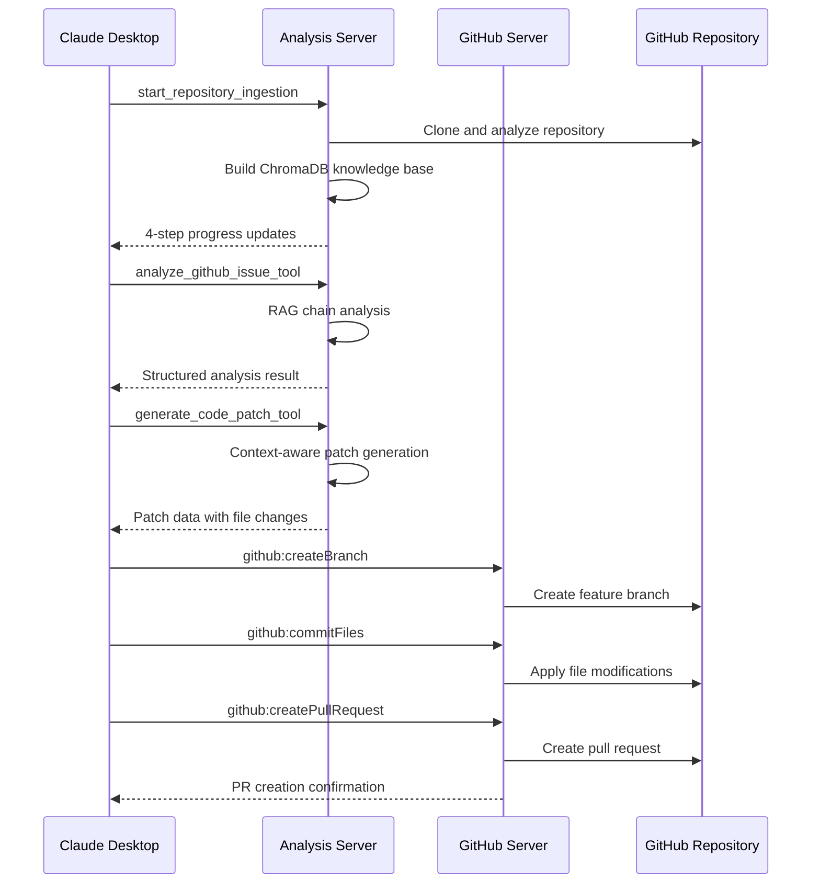

# Dual-Server Workflow

The GitHub Issue Solver uses a revolutionary dual-MCP server architecture to automate issue resolution through a structured, optimized workflow that combines AI intelligence with robust GitHub operations.

## Workflow Overview

Our dual-server architecture enables a sophisticated workflow where the **Analysis Server** acts as the "brain" for intelligent processing, while the **GitHub Server** serves as the "hands" for reliable GitHub operations.

### Phase 1: Repository Knowledge Building (Analysis Server)

#### Step 1: Initialize Ingestion
The process begins with initializing the 4-step ingestion workflow:
```
start_repository_ingestion('owner/repo')
```

#### Step 2: 4-Step Optimized Ingestion Process

**Step 2a: Documentation Ingestion**
```
ingest_repository_docs('owner/repo')
```
- Smart prioritization (README, important docs first)
- Intelligent chunking to prevent chunk explosion
- Real-time progress tracking

**Step 2b: Code Analysis**
```
ingest_repository_code('owner/repo')
```
- Function/class level parsing with performance optimization
- Priority-based file processing (important languages first)
- Efficient batching to prevent timeouts

**Step 2c: Issues History**
```
ingest_repository_issues('owner/repo')
```
- Historical issue analysis with content filtering
- Comment processing with size limits
- Pattern recognition for solution templates

**Step 2d: PR History (Final)**
```
ingest_repository_prs('owner/repo')
```
- Merged PR analysis with diff optimization
- Solution pattern extraction
- Knowledge base completion

All data is converted into vector embeddings and stored in repository-specific ChromaDB collections with complete isolation.

### Phase 2: Intelligent Issue Analysis (Analysis Server)

When a user submits a GitHub issue URL, the Analysis Server performs sophisticated RAG-based analysis:

```
analyze_github_issue_tool('https://github.com/owner/repo/issues/123')
```

**RAG Chain Processing:**
1. **Context Retrieval**: Queries repository knowledge base for relevant information
2. **AI Analysis**: Uses Google Gemini 2.5-Flash with repository context
3. **Output Generation**: Produces structured analysis with:
   - Concise problem summary
   - Detailed, step-by-step proposed solution with file-specific guidance
   - Complexity score (1-5 rating)
   - Links to similar past issues with solutions

### Phase 3: Intelligent Patch Generation (Analysis Server)

Based on the analysis, the system generates precise code patches:

```
generate_code_patch_tool(issue_description, 'owner/repo')
```

**Patch Intelligence:**
- **Context-Aware**: Uses retrieved repository knowledge for targeted changes
- **File-Specific**: Generates exact file modifications with line-level precision
- **Unified Diff Format**: Professional-grade patch format
- **Validation**: JSON validation and error handling

### Phase 4: Robust GitHub Operations (GitHub Server)

The official GitHub MCP server handles all GitHub operations with enterprise-grade reliability:

**Branch Management:**
```
github:createBranch(repository, branchName, baseBranch)
```

**File Modifications:**
```
github:commitFiles(repository, branch, files, message)
```

**Pull Request Creation:**
```
github:createPullRequest(repository, title, body, head, base)
```

**Additional Operations:**
- Issue updates and linking
- Repository management
- Comprehensive GitHub API access

## Dual-Server Coordination

### Communication Flow



### Error Handling & Reliability

- **JSON Communication**: Resolved all parsing issues with proper object returns
- **Timeout Prevention**: Smart yielding and batch processing
- **Fallback Mechanisms**: Graceful degradation for API limits
- **Progress Tracking**: Real-time status updates for long operations
- **Recovery Options**: 4-step process allows resuming from any failed step

## Performance Optimizations

### Analysis Server Optimizations
- **Chunk Reduction**: 60-70% fewer chunks via intelligent processing
- **Priority Processing**: Important files and content first
- **Batch Optimization**: Larger batches for faster embedding
- **Memory Management**: Efficient resource utilization

### GitHub Server Advantages
- **Production-Ready**: Official server with enterprise reliability
- **Complete API Coverage**: Access to all GitHub functionality
- **Performance**: Go implementation for high-speed operations
- **Docker Deployment**: Consistent, isolated execution environment

This dual-server workflow provides the perfect balance of AI intelligence and operational reliability, enabling sophisticated GitHub issue resolution at enterprise scale. 
